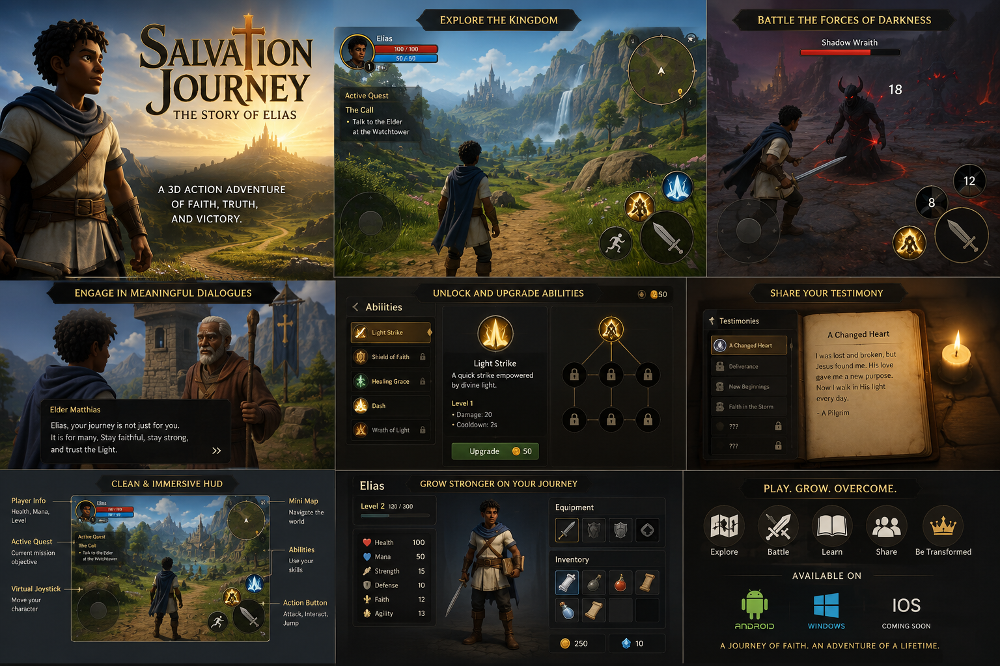

# Salvation Journey

**Salvation Journey** is a third-person 3D Christian action-adventure game currently in early development using **Unity 6** and the **Universal Render Pipeline (URP)**.

The player begins in **Sinful Earth**, receives the message of salvation, and undertakes a dangerous journey toward the **Celestial City**.

Along the way, the player will face physical enemies, spiritual opposition, temptation, fear, deception, difficult choices, and consequences that shape their personal **Testimony**.



> **Concept Art:** The image above represents the intended visual direction, atmosphere, interface style, and gameplay experience for *Salvation Journey*. It is not an in-engine gameplay screenshot.

---

## 🎮 Game Vision

*Salvation Journey* combines:

* third-person 3D exploration
* physical and spiritual combat
* Health, Stamina, and Resolve systems
* Prayer and Scripture-based abilities
* moral choices with persistent consequences
* character growth and spiritual disciplines
* a Testimony system that remembers the player's journey
* cinematic boss encounters
* a journey toward the Celestial City

The central design principle is simple:

> Different threats require different forms of overcoming.

Physical enemies may attack **Health**, while Fear, Deception, Despair, and Accusation can attack **Resolve** and require different responses such as Prayer, Scripture, Discernment, Faith, Courage, or Fellowship.

---

## 🚧 Current Development Status

The project is currently in:

**Early Development / Vertical Slice Production**

The Unity project foundation has been created and development has begun on the first playable systems.

Current work includes:

* Unity 6 URP project architecture
* Android-first project setup
* player state architecture
* Health system
* Resolve system
* Stamina system
* Prayer ability framework
* Fear resistance mechanics
* third-person player foundation
* vertical slice scene planning
* Gatekeeper of Fear prototype design

---

## 🧭 Vertical Slice

The first playable vertical slice follows **Elias**, the initial playable character.

The prototype begins on the outskirts of **Sinful Earth** and will include:

1. Elias receiving the Message of Salvation
2. leaving Sinful Earth
3. choosing between the Narrow Road and an easier shortcut
4. learning Prayer
5. encountering enemies that attack Health and Resolve
6. discovering the **Word of Truth**
7. using Scripture to expose deception
8. confronting the **Gatekeeper of Fear**
9. reaching the first refuge
10. seeing the distant light of the Celestial City

The vertical slice is designed to prove the game's core gameplay philosophy before full production begins.

---

## 🧠 Core Player Systems

The game distinguishes between several player resources.

### Health

Represents physical wellbeing.

Physical attacks, enemies, and environmental hazards reduce Health.

### Stamina

Used for:

* sprinting
* blocking
* dodging
* heavy attacks
* demanding physical actions

### Resolve

Represents emotional and spiritual endurance.

Enemies such as Fear creatures, Whisperers, Accusers, and Despair-based enemies primarily attack Resolve.

---

## 🙏 Prayer System

Prayer is designed as an active spiritual gameplay system rather than a generic power-up.

The first prototype Prayer ability is:

### Stillness

Stillness temporarily strengthens the player's resistance against Fear-based Resolve damage.

Current implementation includes:

* timed activation
* Fear resistance
* Resolve damage reduction
* cooldown-ready architecture

The early implementation can be viewed here:

`Assets/_Project/Scripts/Player/PlayerStateController.cs`

---

## 📖 Scripture System

Scripture will affect gameplay directly.

The first planned Scripture ability is:

### Word of Truth

This ability will allow the player to:

* expose illusions
* reveal deceptive enemies
* identify false paths
* weaken deception-based spiritual effects

The vertical slice will introduce this mechanic using a false bridge puzzle before requiring it during the Gatekeeper boss encounter.

---

## 🐉 Long-Term Game Direction

The full journey is planned across multiple regions, including:

* Sinful Earth
* Gate of Repentance
* Wilderness of Temptation
* Valley of Doubt
* Forest of Distraction
* City of Vanity
* Mountain of Pride
* Desert of Weariness
* Plain of Fellowship
* Valley of Persecution
* Final Ascent
* Dragon's Gate
* Celestial City

The final confrontation will involve the Dragon standing before the entrance to the Celestial City.

The climax is inspired mechanically by **Revelation 12:11**, particularly the themes of:

* the Blood of the Lamb
* the word of their testimony
* faithful perseverance

The player's choices throughout the journey will influence the final encounter.

---

## 🛡️ Planned Spiritual Progression

Future systems include:

* Prayer
* Reading the Word
* Studying the Word
* Fasting
* Fellowship
* Evangelism
* Worship
* Service

The player will also progressively acquire elements of the **Armour of God**, including:

* Belt of Truth
* Breastplate of Righteousness
* Shoes of the Gospel of Peace
* Shield of Faith
* Helmet of Salvation
* Sword of the Spirit

These are intended to function as meaningful gameplay systems rather than decorative equipment.

---

## ⚙️ Technology

**Engine:** Unity 6
**Rendering:** Universal Render Pipeline
**Language:** C#
**Primary Platform:** Android
**Secondary Target:** Windows PC
**Development Model:** Vertical Slice → Sequential Region Production

---

## 📁 Current Project Structure

```text
Assets/
└── _Project/
    ├── Animations/
    ├── Art/
    ├── Audio/
    ├── Materials/
    ├── Prefabs/
    ├── Scenes/
    ├── ScriptableObjects/
    ├── Scripts/
    │   ├── Abilities/
    │   ├── Combat/
    │   ├── Core/
    │   ├── Dialogue/
    │   ├── Enemies/
    │   ├── Player/
    │   ├── Quests/
    │   ├── Saving/
    │   ├── Testimony/
    │   └── UI/
    ├── UI/
    └── VFX/
```

---

## 🧪 Development Philosophy

The project is being developed incrementally.

Current priorities are:

1. player movement
2. third-person camera
3. basic combat
4. Health and Stamina
5. Resolve
6. Fear mechanics
7. Prayer
8. Scripture
9. Gatekeeper prototype
10. narrative and Testimony systems

Large-scale world production will begin only after the core gameplay systems have been proven.

---

## 📌 Current Milestone

The immediate development milestone is:

> Get the placeholder Elias character moving reliably through the Prototype Arena with a functional third-person camera.

After that, combat and spiritual systems will be added one layer at a time.

---

## 📜 Status

**Project Status:** Active Development
**Current Phase:** Vertical Slice Foundation
**Engine:** Unity 6
**Target:** Android-first 3D action-adventure
